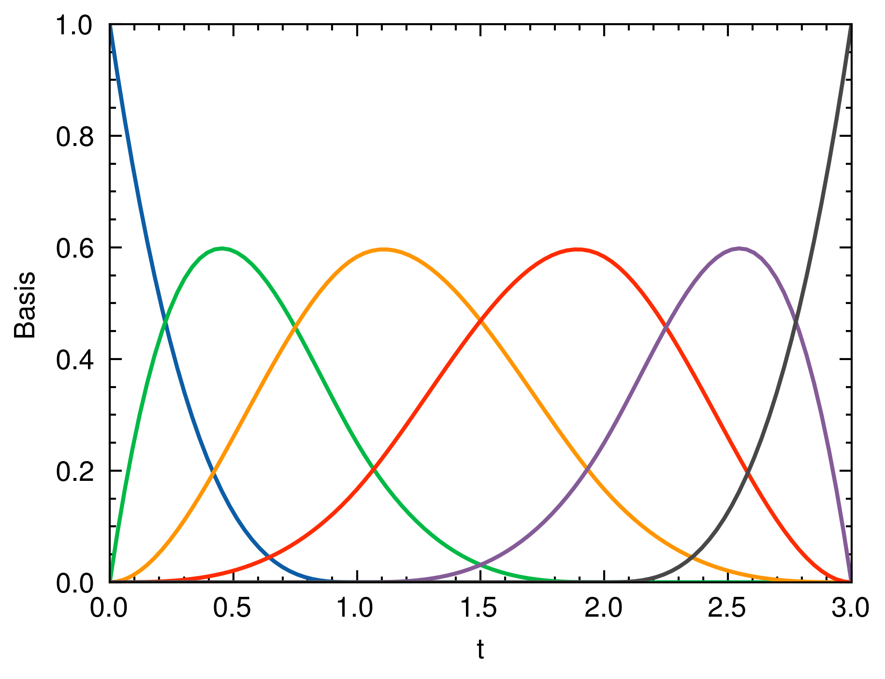
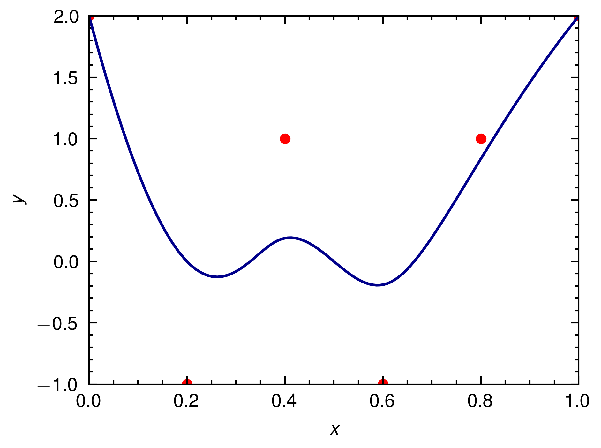

# B-Spline Interpolation in Rust

This repository contains a Rust implementation of B-Spline interpolation. The code demonstrates how to create a B-Spline curve using a set of control points and generate basis functions using the Cox-de Boor recursion formula.

## Features

- Create a B-Spline curve with a specified degree, knot vector, and control points
- Generate basis functions using the Cox-de Boor recursion formula
- Interpolate points along the B-Spline curve
- Plot the basis functions and the interpolated B-Spline curve

## Dependencies

- `peroxide`: For plotting functionality & numerical utils

## Usage

To use the B-Spline interpolation code in your Rust project, follow these steps:

1. Add the necessary dependencies

```sh
cargo add peroxide --features plot
```

2. Import the required modules in your Rust code:

```rust
use peroxide::fuga::*;
use anyhow::Result;
```

3. Create an instance of the `BSpline` struct with the desired parameters:

```rust
let knots = vec![0f64, 0f64, 0f64, 0f64, 1f64, 2f64, 3f64, 3f64, 3f64, 3f64];
let degree = 3;
let num_points = 100;
let control_points = vec![
    vec![0f64, 2f64],
    vec![0.2, -1f64],
    vec![0.4, 1f64],
    vec![0.6, -1f64],
    vec![0.8, 1f64],
    vec![1f64, 2f64],
];

let spline = BSpline::new(degree, knots, num_points, control_points);
```

4. Generate the basis functions and plot them:

```rust
let bases = spline.generate_bases();
spline.bases_plot(bases)?;
```

5. Interpolate points along the B-Spline curve and plot the curve:

```rust
spline.plot()?;
```

## Plots

The code generates two plots:

1. `plot.png`: A plot of the basis functions generated using the Cox-de Boor recursion formula.



2. `interpolate_plot.png`: A plot of the interpolated B-Spline curve using the provided control points.



## License

This code is released under the [MIT License](LICENSE).
